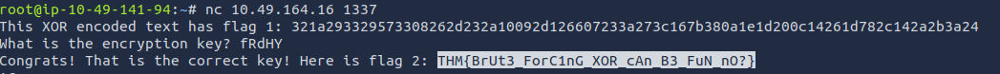
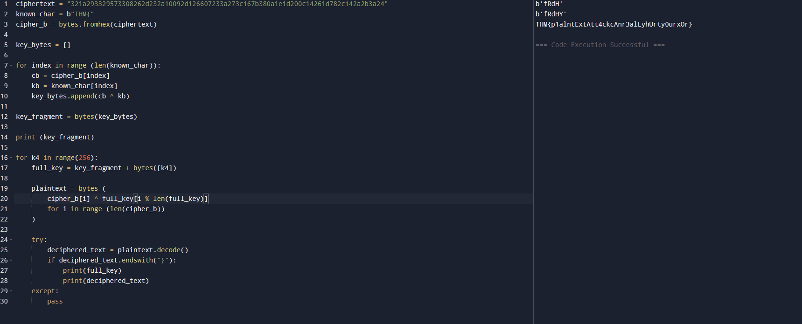
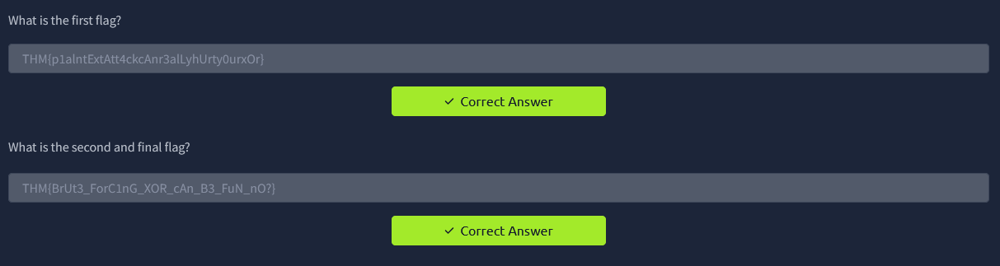

# W1seGuy (TryHackMe)

## Overview
This room is the first challenge room I've completed. This focused on XOR operation and recovering keys using the operation.

## Key Concept

XOR relationship:

ciphertext = plaintext ^ key

key = ciphertext ^ plaintext

plaintext = ciphertext ^ key

Note: In Python ^ is the XOR Operator

References:

https://accu.org/journals/overload/20/109/lewin_1915/  Understanding XOR

https://byjus.com/maths/convert-hexadecimal-to-binary/  Converting Hex to Binary concept

https://www.geeksforgeeks.org/python/bytes-fromhex-method-python/  Converting Hex to Binary Python

##Steps Taken

1. Run NetCat on target IP And Port
2. Grab encrypted text
3. Run XOR solver .py file adding the ciphertext as the value
4. use key value as input for encryption key

Images

## Python Script
To automate XOR operations I created a small script to get the key value

### xor\_solver.py

