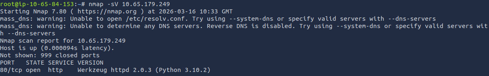
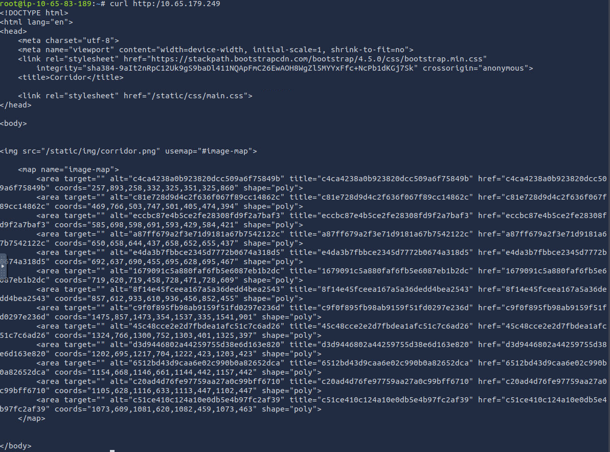
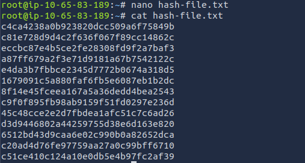
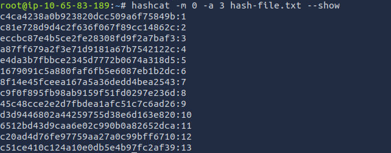
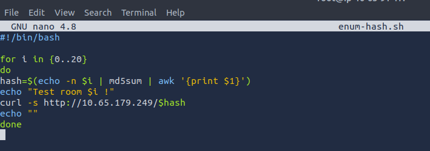
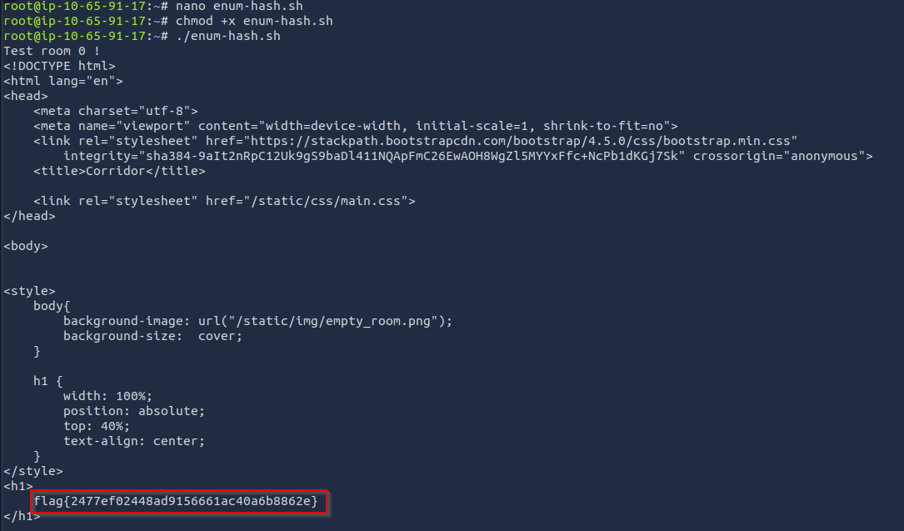

# TryHackMe - Corridor

## Overview

| Field | Value |
|------|------|
| Room | Corridor |
| Category | Web Enumeration / Hash Analysis |
| Difficulty | Easy |
| Tools Used |  Nmap, Curl, Hashcat |


This lab demonstrates how hashed identifiers in web applications can
still be enumerated if the underlying input pattern is predictable.

------------------------------------------------------------------------

# Lab Objective

The goal of this challenge is to discover a **hidden room** within a web
application by analyzing the way room identifiers are implemented.

The application uses **hashed values in URLs instead of plain numeric
identifiers**, which initially appear to obscure the underlying room
numbers.

------------------------------------------------------------------------

# Step 1 -- Service Enumeration

The first step was to identify open services on the target machine.

``` bash
nmap -sV <TARGET_IP>
```


### Result

The scan revealed that **port 80 (HTTP)** was open.




Since a web service was present, the next step was to investigate the
website.

------------------------------------------------------------------------

# Step 2 -- Inspecting the Web Application

To examine the raw response from the web server, I used `curl`.

``` bash
curl http://<TARGET_IP>
```

The HTML response contained **multiple links referencing long
hexadecimal strings**, which resembled **hash values**.

These appeared to represent **hashed room identifiers**.



------------------------------------------------------------------------

# Step 3 -- Extracting Hash Values

The hash values were copied into a text file for analysis.

These hashes appeared consistent with **MD5 formatting**.



------------------------------------------------------------------------

# Step 4 -- Cracking the Hashes

To determine what the hashes represented, I used **Hashcat** to brute
force them. This also confirmed that they were md5 hashes,

``` bash
hashcat -m 0 -a 3 hash-file.txt
```

### Parameters Explained

  Parameter        Description
  ---------------- ----------------------------------
  `-m 0`           MD5 hash mode
  `-a 3`           Mask attack (brute force)
  `hashfile.txt`   File containing extracted hashes

### Result

The hashes corresponded to **sequential numbers**.



This indicated the application was generating URLs like:

    /md5(room_number)

------------------------------------------------------------------------

# Step 5 -- Identifying the Hidden Room

The challenge mentioned a **hidden room**, so I hypothesized that the
hidden endpoint might correspond to a number **outside the visible
range**. 

However, checking each number outside of the range would be too time consuming.

Instead, I created a short bash script to automate the curl command for each hash from 0-20 to see each output.
... This was very very large output, and could have been done a better way...



### Result

the resulting output came out with the flag, although I had to manually search the output.




------------------------------------------------------------------------

# Vulnerability

The vulnerability stems from **predictable identifier hashing**.

Instead of secure access control, the application uses:

    room_number → md5(room_number)

This approach is insecure because attackers can simply generate hashes
for possible values.

------------------------------------------------------------------------

# Attacker Methodology

The attack process followed a standard methodology:

1.  Service discovery with **Nmap**
2.  Web enumeration using **curl**
3.  Identification of **hash patterns**
4.  Hash analysis and cracking using **Hashcat**
5.  Identification of **numeric sequence**
6.  Testing **edge cases**
7.  Discovering hidden endpoint

------------------------------------------------------------------------

# Lessons Learned

Key takeaways from this lab:

-   Hashing identifiers **does not provide security**
-   Predictable input patterns allow **enumeration attacks**
-   Simple **reconnaissance and pattern analysis** can uncover hidden
    resources
-   Attackers often test **edge cases** (0, negative numbers, large
    numbers)


